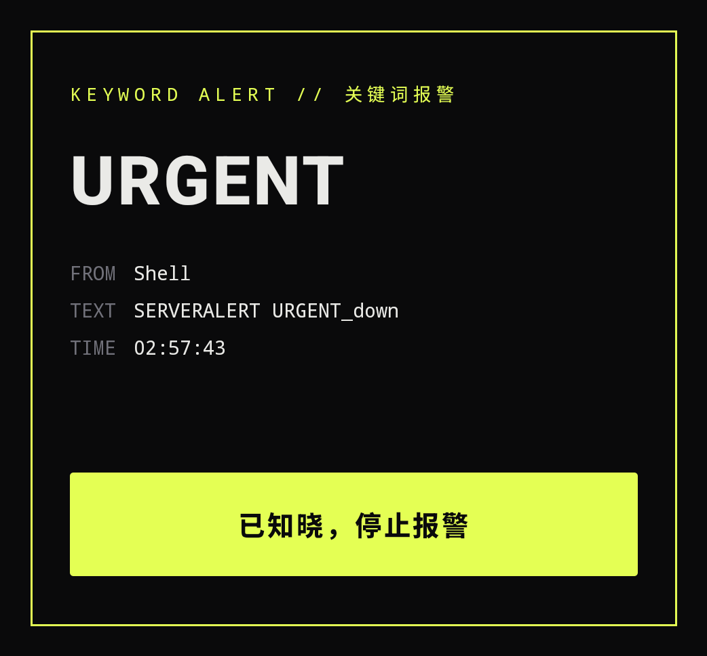
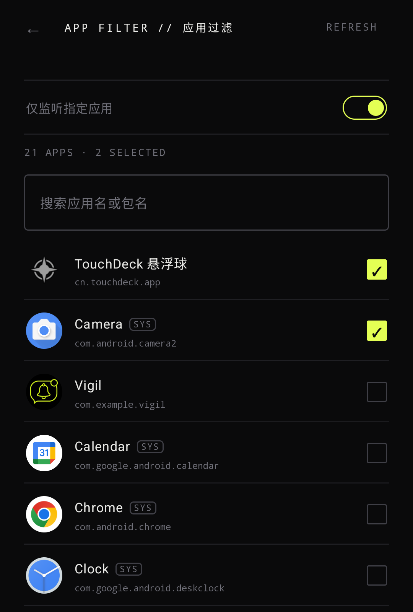
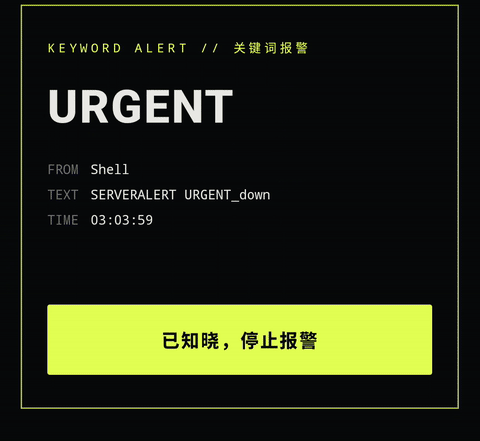

<div align="center">


# Vigil

**Android 通知关键词监控应用**

以闹钟音频流强制响铃穿透静音，让关键通知尽可能不被错过

[](https://developer.android.com) [](https://kotlinlang.org) [](https://developer.android.com/jetpack/compose)

[](https://github.com/XGWNJE/Vigil/releases) [](LICENSE)

[功能特性](#-功能特性) · [截图](#-截图) · [快速开始](#-快速开始) · [权限说明](#-权限说明) · [已知限制](#-已知限制) · [文档地图](#-文档地图)

</div>

---

## 简介

Vigil 是一款运行于 Android 的通知监控工具。当任意应用推送的通知内容命中预设关键词时，Vigil 会**在应用内弹出全屏报警提醒，并强制触发报警铃声**（后台运行时铃声同样生效）。报警铃声走闹钟音频流，音量独立于铃声/媒体音量，设备静音或震动模式下照常响铃。

适用场景：服务器宕机告警、银行到账提醒、特定消息监控等对通知实时性要求极高的场景。

---

## ✨ 功能特性

| 功能 | 描述 |
|------|------|
| **关键词匹配** | 多关键词 Chip 管理，添加即保存；删除需二次确认 |
| **关键词级铃声** | 点按关键词 Chip 可单独绑定铃声与循环次数，未配置的跟随全局默认 |
| **铃声库** | 内置预设语音（随 APK 打包，开箱可用）+ 自定义来源：导入音频文件（复制到应用内，防原文件失效）或现场录音，支持命名、删除、试听；文件缺失时自动回落默认闹钟铃声 |
| **循环次数** | 1–10 次逐次调节；到数自动结束（停铃、关弹窗、写入记录），不再无限循环 |
| **报警记录** | 每次报警结束（手动确认或自动结束）留痕：关键词、来源应用、时间、结束方式，可随时查看/清空 |
| **报警快捷通知** | 响铃期间显示高优先级前台通知，点击可随时进入应用处理当前报警；结束后自动恢复普通监听通知 |
| **状态首页** | 全屏涟漪动效随服务状态变化（颜色/节奏），中央核心圆点即服务开关；设置收进底部 Sheet |
| **强制报警** | 闹钟音频流（`USAGE_ALARM`）循环播放铃声，音量独立、静音模式照常响铃；应用内全屏弹窗展示命中关键词与摘要 |
| **应用过滤** | 只监听指定应用或全部应用；已勾选应用置顶 |
| **报警恢复** | 未确认状态持久化，进程被系统杀死后重建可在 30 分钟内自动恢复响铃与弹窗 |
| **前台保活** | 前台服务常驻 + 心跳检测 + 断连自动重绑与快速自愈（`requestRebind` / 组件 toggle / 失效即引导重新授权） |
| **权限引导** | 设置内按必需/推荐/可选分级展示权限状态，缺失时一键跳转授权 |
| **诊断日志** | 本地滚动日志（不含通知正文），主屏一键导出分享，便于排查 |
| **应用自更新** | 从 GitHub 检查新版本，冷启动自动提示（含发版说明，可一键下载安装）；版本号文本可点击手动复检；网络无法访问 GitHub 时给出明确提示 |
| **极致轻量** | 安装包约 3.4MB，几乎不占空间，常驻后台资源占用低 |

---

## 📸 截图

<div align="center">

| 主界面 | 关键词报警 | 应用过滤 |
|:------:|:---------:|:--------:|
|  |  |  |

| 报警闭环演示（命中关键词 → 弹窗脉冲 → 确认停铃） |
|:----------------------------------------------:|
|  |

*点击图片可查看大图*

</div>

---

## 🚀 快速开始

1. 从 [Releases](https://github.com/XGWNJE/Vigil/releases) 下载 APK 直接安装；或自行构建：

   ```bash
   git clone https://github.com/XGWNJE/Vigil.git && cd Vigil && ./gradlew assembleDebug
   ```

   环境要求：Android Studio Hedgehog+ / JDK 17+；最低 Android 8.0（API 26），目标 SDK 35。构建与真机测试完整细节见 `AGENTS.md`。

2. 首次使用：授予**通知使用权**与**电池白名单**（可选：自启动/后台运行）→ 添加关键词 → 选择铃声 → 回到首页点按中央核心圆点开启服务。

---

## 🔒 权限说明

| 权限 | 用途 | 授权方式 |
|------|------|----------|
| 通知使用权（NotificationListenerService） | 读取通知内容，核心功能依赖 | 系统设置手动授予 |
| 发送通知（POST_NOTIFICATIONS，Android 13+） | 前台服务常驻通知，以及响铃时可点击进入处理的报警通知 | 首次启动自动弹窗 |
| 前台服务（FOREGROUND_SERVICE_SPECIAL_USE） | 维持后台监听服务持续运行 | 自动（Manifest 声明） |
| 唤醒锁（WAKE_LOCK） | 报警时保持 CPU 唤醒，确保铃声持续播放 | 自动（Manifest 声明） |
| 忽略电池优化 | 防止厂商省电策略在报警时强杀进程 | 设置内一键引导 |
| 全屏 Intent（USE_FULL_SCREEN_INTENT） | 后台无法弹窗时，以全屏通知在锁屏上报警 | 自动（Manifest 声明） |
| 麦克风（RECORD_AUDIO） | 铃声库「录音」来源，录制内容仅存本地 | 录音时系统弹窗申请 |
| 联网（INTERNET） | 「检查更新」时从 GitHub 读取最新版本信息与 APK 下载地址 | 自动（Manifest 声明） |
| 安装应用（REQUEST_INSTALL_PACKAGES） | 一键更新时调起系统安装器安装新版本 APK | 更新时引导授权 |

> 通知使用权需手动授予，应用内提供直达跳转入口。应用过滤无需任何权限（通过 launcher intent 查询，不申请 `QUERY_ALL_PACKAGES`）；`INTERNET` 仅用于「检查更新」时访问 GitHub 读取版本信息，无其它联网行为，数据全部本地处理。详见 [隐私政策](PRIVACY.md)。

> **国产 ROM 使用须知**：小米 / 华为 / OPPO / vivo 等系统有激进的省电与自启动管控，可能清理进程后不再重绑监听服务。请完成「自启动管理」与「后台运行」引导；应用内置断连自愈，断连时显示「重连中」而非误报「监听中」。建议让 Vigil 长期驻留后台以获得稳定监控——多数安卓系统如今对后台权限与自启动的管理都比较严格，若只是临时打开、用完即退出，之后系统会更频繁地要求重新授权，属正常现象。

---

## ⚠️ 已知限制

- **勿扰模式**：闹钟音频流默认被勿扰策略放行（闹钟例外），正常响铃；若用户在勿扰设置中关闭闹钟例外或设为完全静音，铃声会被压制。应用不申请勿扰访问权限、不干预勿扰设置（Android 15+ 已[禁止应用修改全局勿扰状态](https://developer.android.com/about/versions/15/behavior-changes-15)）。
- **后台弹窗**：Android 10+ 限制后台启动 Activity，应用内全屏弹窗不一定能立即前置；自动回退为全屏 Intent 通知，响铃不受影响。
- **进程存活**：响铃依赖服务进程存活；前台服务 + 电池白名单大幅降低被回收概率但无法根除；未确认报警已持久化，进程重建后 30 分钟内自动恢复。
- **监听绑定**：部分国产 ROM 清理进程后可能不再重绑监听；内置看门狗自愈，仍无效时会在主屏尽快给出「重新授权」引导，无需卸载重装。

---

## 🏗 技术架构

Kotlin + Jetpack Compose（Material 3），MVVM，单 Activity。核心链路：监听匹配 → 闹钟音频流循环响铃 + WakeLock → 应用内全屏弹窗确认停止，关键状态全程持久化。组件职责与设计主题详见 `AGENTS.md`。

---

## 📚 文档地图

- `README.md` — 本文件（面向人：项目是什么、怎么开始）
- `AGENTS.md` — 面向 Agent 的完整操作规则（铁律、构建命令、真机测试流程、验证矩阵）
- `ROADMAP.md`（路线图）· `PRIVACY.md`（隐私政策）· `store/`（商店素材）· `release-notes/`（发行描述）· `design-backup/`（设计稿存档）

---

## 📄 许可证

本项目基于 [MIT License](LICENSE) 开源。
