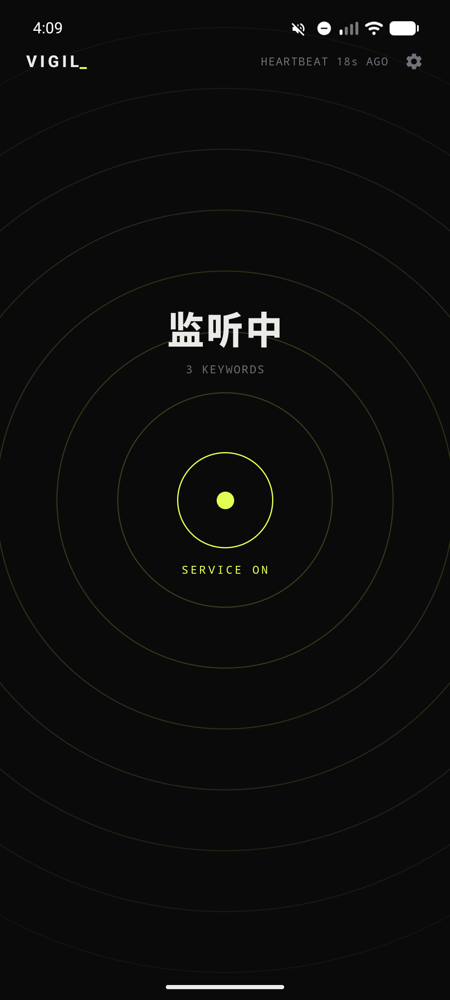
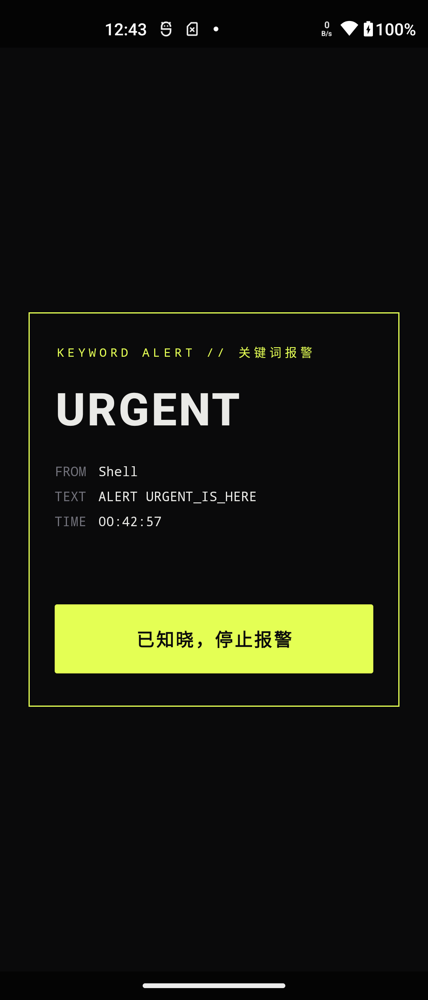
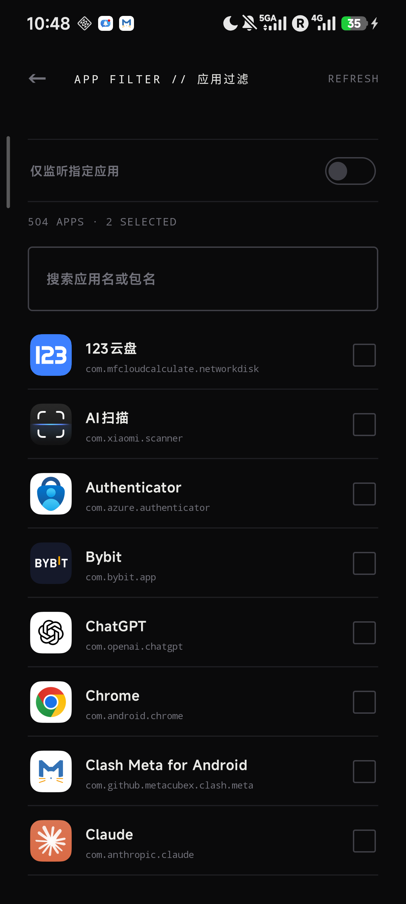

<div align="center">


# Vigil

**Android 通知关键词监控应用**

以闹钟音频流强制响铃穿透静音，让关键通知尽可能不被错过

[](https://developer.android.com)
[](https://kotlinlang.org)
[](https://developer.android.com/jetpack/compose)
[](https://github.com/XGWNJE/Vigil/releases)
[](LICENSE)

[功能特性](#-功能特性) · [截图](#-截图) · [快速开始](#-快速开始) · [权限说明](#-权限说明) · [已知限制](#-已知限制) · [技术架构](#-技术架构)

</div>

---

## 简介

Vigil 是一款运行于 Android 的通知监控工具。当任意应用推送的通知内容命中预设关键词时，Vigil 会**在应用内弹出全屏报警提醒，并强制触发报警铃声**（后台运行时铃声同样生效）。报警铃声走闹钟音频流，音量独立于铃声/媒体音量，设备静音或震动模式下照常响铃；勿扰模式下的行为见[已知限制](#-已知限制)。

适用场景：服务器宕机告警、银行到账提醒、特定消息监控等对通知实时性要求极高的场景。

---

## ✨ 功能特性

| 功能 | 描述 |
|------|------|
| **关键词匹配** | 多关键词 Chip 标签式管理，添加/删除即保存，无需手动确认 |
| **强制报警** | 以闹钟音频流（`USAGE_ALARM`）循环播放铃声，音量独立于铃声/媒体音量，静音模式下照常响铃；应用内全屏弹窗展示命中关键词与通知摘要 |
| **应用过滤** | 可选择只监听指定应用的通知，或监听全部应用 |
| **报警恢复** | 触发报警时持久化未确认状态，进程被系统杀死后重建可在 30 分钟有效期内自动恢复响铃与弹窗 |
| **前台服务保活** | 以前台服务形式常驻，配合电池白名单降低系统回收概率 |
| **权限引导** | 主界面集中展示必要权限状态（通知使用权、电池白名单、自启动、后台运行），缺失时一键跳转授权 |
| **心跳检测** | 单调时钟心跳，实时感知服务存活状态；绑定断开时显示「重连中」而非误报「监听中」 |
| **监听自愈** | 服务看门狗检测到断连自动 `requestRebind`，失败时升级组件 toggle 重绑 |
| **诊断日志** | 关键运行事件本地持久化（自动滚动、不含通知正文），主屏「导出日志」一键分享，便于真机长测后排查问题 |

---

## 📸 截图

<div align="center">

| 主界面 | 报警界面 | 应用过滤 |
|:--------:|:--------:|:--------:|
|  |  |  |

*点击图片可查看大图*

</div>

---

## 🚀 快速开始

### 环境要求

- Android Studio Hedgehog 或更高版本
- JDK 17+
- 最低 Android 版本：**8.0（API 26）**
- 目标 / 编译 SDK：**35（Android 15）**

### 构建步骤

```bash
# 克隆仓库
git clone https://github.com/XGWNJE/Vigil.git
cd Vigil

# 构建 debug APK
./gradlew assembleDebug
```

生成的 APK 位于 `app/build/outputs/apk/debug/`。

### 安装

```bash
# 通过 ADB 安装到已连接设备
adb install app/build/outputs/apk/debug/app-debug.apk
```

> 主力机若已安装 release 签名包，debug 包会因签名冲突无法覆盖安装，此时请改用 `./gradlew assembleRelease` 并安装 `app/build/outputs/apk/release/app-release.apk`（数据无损）。

### 首次使用

1. 打开应用，在首页完成权限授权：
   - **通知使用权**（核心必需，系统设置中授予）
   - **电池白名单**（防止省电策略强杀进程）
   - **自启动管理 / 后台运行**（国产 ROM 建议配置）
2. 点击关键词行的 **+** 添加需要监控的关键词
3. 点击「铃声」选择报警铃声（默认使用系统闹钟铃声）
4. 可选：点击「应用过滤」选择只监听特定应用
5. 打开顶部服务开关，状态显示「监听中」即开始工作

---

## 🔒 权限说明

| 权限 | 用途 | 授权方式 |
|------|------|----------|
| 通知使用权（NotificationListenerService） | 读取所有应用通知内容，核心功能依赖 | 系统设置手动授予 |
| 发送通知（POST_NOTIFICATIONS，Android 13+） | 前台服务常驻通知 | 首次启动自动弹窗 |
| 前台服务（FOREGROUND_SERVICE_SPECIAL_USE） | 维持后台监听服务持续运行 | 自动（Manifest 声明） |
| 唤醒锁（WAKE_LOCK） | 报警触发时保持 CPU 唤醒，确保铃声持续播放 | 自动（Manifest 声明） |
| 查询已安装应用（QUERY_ALL_PACKAGES） | 应用过滤列表枚举设备应用 | 自动（Manifest 声明） |
| 忽略电池优化（REQUEST_IGNORE_BATTERY_OPTIMIZATIONS） | 防止厂商省电策略在报警响铃时强杀进程 | 首页「电池白名单」一键引导 |
| 全屏 Intent（USE_FULL_SCREEN_INTENT） | 后台无法弹出应用内弹窗时，备选报警通知以全屏 Intent 在锁屏上弹出 | 自动（Manifest 声明） |

> **注意**：通知使用权需在系统设置中手动授予，应用内提供直达跳转入口。

> **国产 ROM（小米 / 华为 / OPPO / vivo / 荣耀等）使用须知**：这些系统有激进的省电与自启动管控，可能在进程被清理后不再重新绑定监听服务。请在首页完成「自启动管理」与「后台运行」两项额外引导。应用内置断连自愈机制（心跳看门狗自动 `requestRebind` / 组件重绑），断连时状态显示「重连中」而非误报「监听中」。

---

## ⚠️ 已知限制

为避免误设预期，以下边界条件如实说明：

- **勿扰模式**：报警铃声走闹钟音频流，Android 勿扰默认允许「闹钟」例外，此时正常响铃；若用户在勿扰设置中关闭了闹钟例外或设为完全静音，铃声会被系统压制。应用不申请勿扰访问权限、不干预用户的勿扰设置（Android 15+ 起平台也已[禁止应用修改全局勿扰状态](https://developer.android.com/about/versions/15/behavior-changes-15)），按系统当前策略响铃。
- **后台弹窗**：Android 10+ 限制后台应用启动 Activity，应用内全屏弹窗不保证能立即前置到锁屏/其他应用之上；此时自动回退为高优先级全屏 Intent 通知，响铃不受影响。
- **进程存活**：响铃依赖服务进程存活。前台服务 + 电池白名单可大幅降低被回收概率，但无法根除厂商省电策略强杀；未确认报警已持久化，进程重建后 30 分钟内可自动恢复响铃与弹窗。
- **监听绑定**：部分国产 ROM 在清理进程后可能不再重新绑定监听服务，此时权限设置仍在但通知不再送达；应用内置看门狗自愈（见上方权限说明），无法自愈时需重新打开应用触发重绑。

---

## 🏗 技术架构

### 语言 / 框架

- **Kotlin** + **Jetpack Compose**（Material 3）
- **MVVM** 架构：`ViewModel` + `mutableStateOf`
- **Navigation Compose** 单页 + 子页导航

### 核心组件

| 文件 | 职责 |
|------|------|
| `MyNotificationListenerService` | 通知监听、关键词匹配、铃声播放、WakeLock 管理、报警恢复 |
| `VigilEventBus` | 基于 `SharedFlow` 的进程内事件总线 |
| `MonitoringViewModel` | 服务状态、心跳检测、报警 Dialog 状态管理 |
| `SettingsViewModel` | 关键词列表、铃声、应用过滤列表的状态与持久化 |
| `SharedPreferencesHelper` | 所有配置的读写封装（关键词以 `StringSet` 存储） |
| `ListenerRecovery` | 监听绑定自愈：`requestRebind` / 组件 toggle 重绑 |
| `PermissionUtils` | 各权限的检测与跳转逻辑，含国产 ROM 自启动 / 后台运行引导 |
| `MainActivity` | Compose 根宿主，生命周期管理，服务启停，报警弹窗承载 |

### UI 页面

| 页面 | 描述 |
|------|------|
| **MainScreen** | 「一线」单页主界面：状态词 + 服务大开关，发丝线列表承载关键词、铃声、应用过滤、权限入口 |
| **AppFilterScreen** | 「一线」独立全屏页，支持搜索、系统 / 用户应用标记、多选 |
| **KeywordAlertDialog** | 命中关键词时全屏弹出，确认后停止铃声；内容居中，避开系统导航栏 |
| **PermissionGuideDialog** | 「一线」权限引导确认弹窗，确认后跳转对应系统设置 |

### 设计主题

「一线」极简深色主题，发丝线分区、无卡片，单一强调色：

```
背景色:   #0A0A0B
文字色:   #EAEAE7
分割线:   #1F1F23
主色调:   #E4FF54（酸橙绿）
警示色:   #FFB020（琥珀）
```

---

## 📄 许可证

本项目基于 [MIT License](LICENSE) 开源。

---

<div align="center">

Made with ❤️ for Android

</div>
