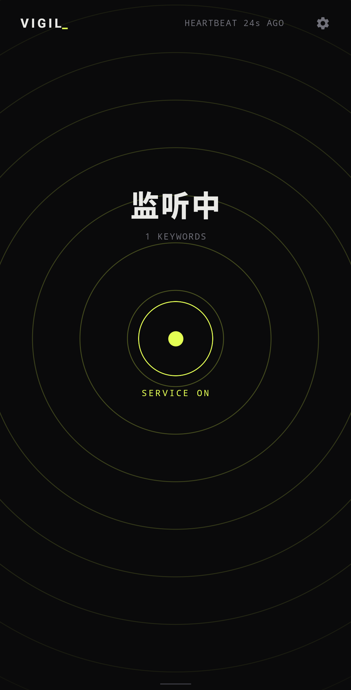
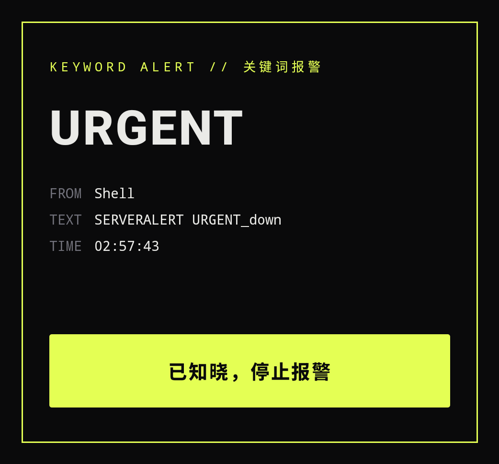
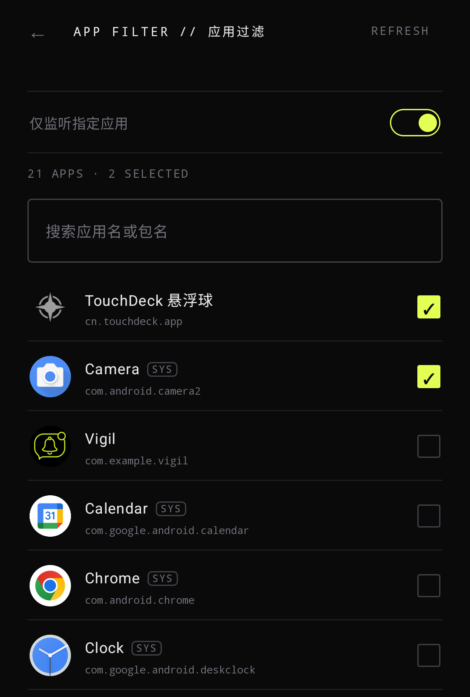

#  Vigil

Android 通知关键词报警应用。设置关键词和监听范围后，匹配的通知会触发闹钟铃声；你可以在应用内确认停铃，也可以让铃声按设定次数自动结束。

[使用场景](#使用场景) · [界面预览](#界面预览) · [快速开始](#快速开始) · [常用设置](#常用设置) · [使用前注意](#使用前注意) · [源码构建](#从源码构建)

[](https://github.com/XGWNJE/Vigil/releases/latest) [](#快速开始) [](LICENSE)

## 使用场景

适合需要盯住值班告警、交易提醒或特定消息通知的人。报警依赖系统允许 Vigil 持续监听通知；各品牌的后台限制和勿扰设置会影响提醒效果。

| 场景 | 你设置什么 | 命中后会发生什么 |
| --- | --- | --- |
| 值班告警 | 告警关键词，必要时只选工作应用 | 按设定次数播放铃声，打开 Vigil 可确认停铃 |
| 不想立即打断 | 固定延时或每日定点 | 通知命中后，等待指定时长或最近的指定时刻再报警 |
| 同类消息反复出现 | 大于零的重复提醒间隔 | 同一应用、同一关键词在间隔内不重复响铃 |

## 界面预览

| 监听首页 | 报警弹窗 | 应用过滤 |
| :---: | :---: | :---: |
|  |  |  |

## 快速开始

1. 在[最新发行版](https://github.com/XGWNJE/Vigil/releases/latest)的 **Assets** 中下载 `.apk` 文件，安装到 Android 8.0 或更高版本的设备。
2. 打开 Vigil，点右上角齿轮或从首页底部上滑进入设置，添加关键词，并按引导授予**通知使用权**；Android 13 及以上还应允许**发送通知**，以显示监听和报警通知。
3. 按应用内引导关闭针对 Vigil 的电池优化，按需配置铃声、播放次数、应用过滤和延时策略；返回首页，点中央圆点开启监听，并确认显示「监听中」。
4. 报警时，在应用内点「已知晓，停止报警」；若应用在后台，可点报警通知进入，也可手动打开 Vigil 处理。

## 常用设置

- **铃声与次数**：使用独立的闹钟音量，播放次数可设为 1–10 次；支持系统铃声、内置预设、导入音频和录音。点按已有关键词，可单独设置铃声、次数和延时策略。
- **延时报警**：默认命中即报警；可改为固定延时或命中后最近的每日定点，没有通知命中就不会生成报警。设置页可查看、取消待触发项；关闭监听会取消全部待触发项。
- **排队与重复提醒**：需要播放的报警按入队顺序处理；重复提醒间隔大于零时，同一应用、同一关键词在间隔内的命中会合并到仍在队列中的报警，已结束的则忽略此次命中。
- **记录与更新**：设置中可查看报警记录、导出诊断日志或手动检查更新；应用启动时也会检查 GitHub 新版本。

## 使用前注意

- **后台与锁屏**：Android 10 及以上可能阻止应用从后台直接弹出窗口；此时点报警通知或手动打开应用。厂商省电策略可能中断监听，请检查应用内的连接状态，并按引导设置电池优化、自启动和后台运行。
- **勿扰模式**：铃声走闹钟音频流，但仍受设备的闹钟音量和勿扰规则控制；Vigil 不会修改系统勿扰设置。
- **延时精度**：Android 12 及以上若未授予「闹钟和提醒」，延时报警使用非精确系统闹钟，可能晚于设定时间。设备关机期间不能响铃，重启后的触发时间不作保证。
- **报警恢复**：当前报警和等待队列保存在本机；进程意外结束后，服务重建时会尝试恢复首次触发未超过 30 分钟、且尚未播完的报警。继续接收新通知仍需通知监听连接正常。

通知内容只在设备上用于关键词匹配；诊断日志不写通知正文。更新检查和 APK 下载会访问 GitHub，完整数据说明见[隐私政策](PRIVACY.md)。

## 从源码构建

准备 Git、JDK 17 和 Android SDK Platform 35，通过 Android Studio 配置 SDK 路径，或设置 `ANDROID_HOME` 指向 SDK 目录，然后运行：

```bash
git clone https://github.com/XGWNJE/Vigil.git
cd Vigil
./gradlew assembleDebug
```

Windows PowerShell 可运行 `./gradlew.bat assembleDebug`。成功后 APK 位于 `app/build/outputs/apk/debug/app-debug.apk`；构建失败时先检查 JDK、Android SDK 与 Gradle 的错误输出。发布包需要仓库维护者的签名配置，构建与设备验证细节见 [AGENTS.md](AGENTS.md)。

## 更多文档

- [ROADMAP.md](ROADMAP.md)：已确认的规划与已交付里程碑。
- [PRIVACY.md](PRIVACY.md)：中英双语隐私政策。
- [store/README.md](store/README.md)：商店上架文案和权限用途。
- [release-notes/](release-notes/)：各版本的发行说明。
- [AGENTS.md](AGENTS.md)：项目开发、验证和发布操作规则。

欢迎通过 [GitHub Issues](https://github.com/XGWNJE/Vigil/issues) 反馈问题。本项目采用 [MIT License](LICENSE)。
